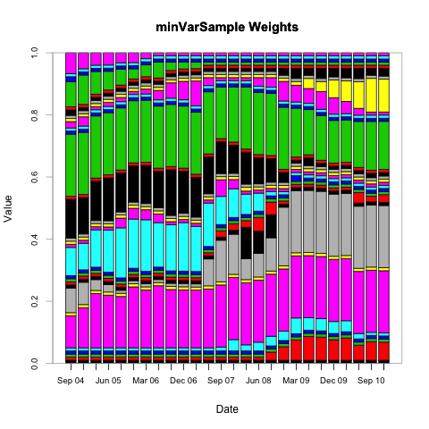
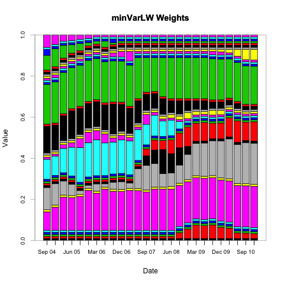
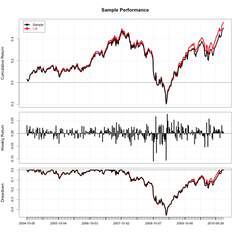
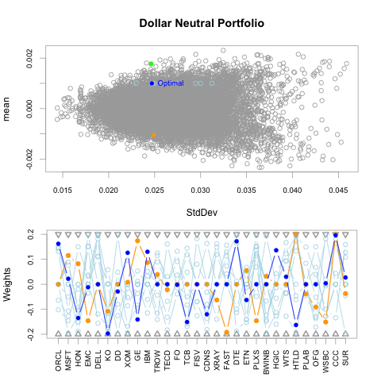
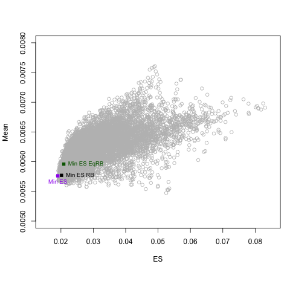
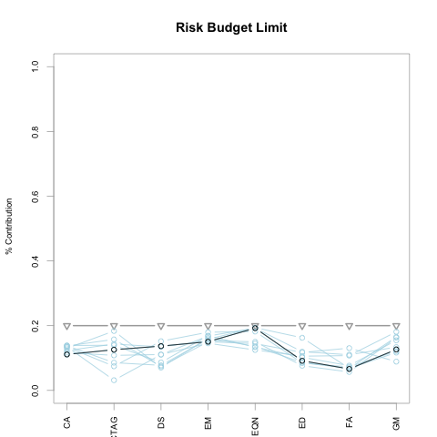
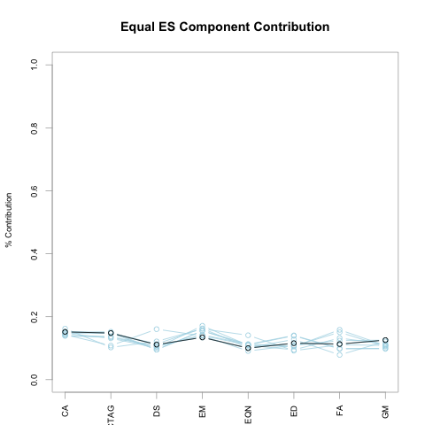
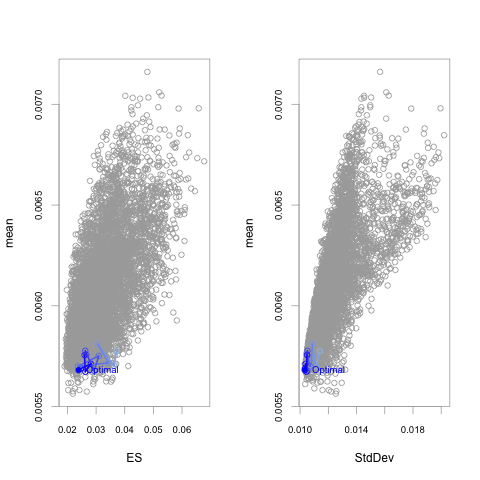
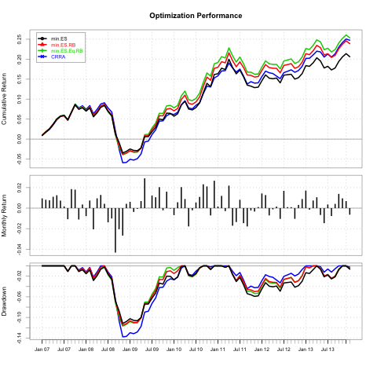

```{r, echo=FALSE}
library(knitr)
opts_chunk$set(fig.height=4.5, fig.cap="", tidy=FALSE, cache=TRUE)
```


# Portfolio Optimization

## General
TODO: Add some general comments here about goals and pitfalls of optimizatio in the context of constructing a portfolio.

## Modern Portfolio Theory
"Modern" Portfolio Theory (MPT) was introduced by Harry Markowitz in 1952.

In general, MPT states that an investor's objective is to maximize portfolio expected return for a given amount of risk.

General Objectives

* Maximize a measure of gain per unit measure of risk
* Minimize a measure of risk
* Maximize a utility function

How do we define risk?

## Portfolio Optimization Objectives
* Minimize Risk
    * Volatility
    * Tail Loss (VaR, ES)
    * Other Downside Risk Measure
* Maximize Risk Adjusted Return
    * Sharpe Ratio
    * Modified Sharpe Ratio
    * Several Others
* Risk Budgets
    * Equal Component Contribution to Risk (i.e. Risk Parity)
    * Limits on Component Contribution
* Maximize a Utility Function
    * Quadratic, CRRA, CARA, etc.

# PortfolioAnalytics

## Overview

PortfolioAnalytics is an R package designed to provide numerical solutions and visualizations for portfolio optimization problems with complex constraints and objectives.

## Key Features

* Support for multiple constraint and objective types
* Modular constraints and objectives
* An objective function can be any valid R function
* Custom moments
* Solver agnostic
* Visualizations

<!---
The key points to make here are:
- Flexibility
  - The multiple types and modularity of constraints and objectives allows us to add, remove, combine, etc. multiple constraint and objective types very easily.
  - Define an objective as any valid R function
  - Define a function to compute the moments (sample, robust, shrinkage, factor model, GARCH model, etc.)
- PortfolioAnalytics comes "pre-built" with several constraint types.
-->


## Support Multiple Solvers

Linear and Quadratic Programming Solvers

* R Optimization Infrastructure (ROI)
    * GLPK (Rglpk)
    * Symphony (Rsymphony)
    * Quadprog (quadprog)

Global (stochastic or continuous solvers)

* Random Portfolios
* Differential Evolution (DEoptim)
* Particle Swarm Optimization (pso)
* Generalized Simulated Annealing (GenSA)

## Random Portfolios
TODO: Add graphic comparing the three methods

## Random Portfolios: Simplex Method
TODO: Add graphic with different fev biasing values

## Workflow
TODO: Add a nice graphic here (Guy might have one)

Specify a Portfolio --> Add Constraints --> Add Objectives --> Run Optimization --> Analyze Results

<!---
Describe each function:
- portfolio.spec
- add.constraint
- add.objective
- optimize.portfolio and optimize.portfolio.rebalancing
Just give a general description of the functions to analyze results
-->

# Data

## Data Setup
Here we will look at portfolio optimization in the context of portfolio of hedge funds

* EDHEC-Risk Alternative Indexes
* Monthly returns from 1/31/1997 to 1/31/2014
    * Convertible Arbitrage (CA)
    * CTA Global (CTAG)
    * Distressed Securities (DS)
    * Emerging Markets (EM)


## Monthly Returns
```{r, echo=FALSE}
suppressPackageStartupMessages(library(PortfolioAnalytics))
load("data/edhec.rda")
R <- edhec[,1:4]
colnames(R) <- c("CTAG", "DS", "CA", "EM")
p <- 0.95
```

```{r, echo=FALSE, cache=TRUE, fig.height=4.5, fig.cap=""}
charts.BarVaR(R, width=36, methods=c("ModifiedES", "ModifiedVaR"))
```

## Distribution of Monthly Returns
```{r, echo=FALSE, message=FALSE, fig.height=4.5, fig.cap=""}
# par(mar=c(5, 4, 4, 2) + 0.1)
boxplot(coredata(R[,order(ES(R, p=p, invert=FALSE))]),
        cex.axis=0.8, las=3, ylab="Returns", pch=18,
        main="Return Distribution\n(sorted by Modified ES (95%))")
# par(mar=c(5, 4, 4, 2) + 0.1)
# dev.off()
```


# Example 1

## Minimum Variance Portfolio
Consider a portfolio of stocks. Our objective to minimize portfolio variance subect to full investment and box constraints. We will use out of sample backtesting to compare the sample covariance matrix estimate and a Ledoit-Wolf shinkage estimate. 

<!---
Demonstrate a custom moments function to compare a sample covariance matrix estimate and a Ledoit-Wolf shrinkage covariance matrix estimate. An alternative is a robust (MCD, MVE, etc.) estimate, DCC GARCH model, factor model, etc.
-->

## Data
```{r, eval=FALSE}
load("data/crsp_weekly.rda")
equity.data <- cbind(largecap_weekly[,1:10], 
                     midcap_weekly[,1:10], 
                     smallcap_weekly[,1:10])
```

## Specify Portfolio
```{r,eval=FALSE}
stocks <- colnames(equity.data)
portf.init <- portfolio.spec(stocks)
portf.minvar <- add.constraint(portf.init, type="full_investment")
portf.minvar <- add.constraint(portf.minvar, type="box", min=0.01, max=0.2)
portf.minvar <- add.objective(portf.minvar, type="risk", name="var")
```

<!---
Talk a little about adding constraints and objectives
-->

## Ledoit-Wolf Shrinkage Estimate
The default function for `momentFUN` is `set.portfolio.moments`. We need to write our own function to estimate the covariance matrix.
```{r, eval=FALSE}
lw.sigma <- function(R, ...){
  out <- list()
  # estimate covariance matrix via ledoit-wolf shrinkage
  out$sigma <- lwShrink(R)$cov
  return(out)
}
```

## Backtesting Parameters
```{r, eval=FALSE}
# Set rebalancing frequency
rebal.freq <- "quarters"
# Training Period
training <- 400
# Trailing Period
trailing <- 250
```


## Run Optimization
```{r, eval=FALSE}
opt.minVarSample <- optimize.portfolio.rebalancing(equity.data, portf.minvar, 
                                                   optimize_method="ROI", 
                                                   rebalance_on=rebal.freq, 
                                                   training_period=training, 
                                                   trailing_periods=trailing)
opt.minVarLW <- optimize.portfolio.rebalancing(equity.data, portf.minvar, 
                                               optimize_method="ROI", 
                                               momentFUN=lw.sigma,
                                               rebalance_on=rebal.freq, 
                                               training_period=training, 
                                               trailing_periods=trailing)
```

## Chart Weights
```{r, eval=FALSE}
chart.Weights(opt.minVarSample, main="minVarSample Weights", legend.loc=NULL)
chart.Weights(opt.minVarLW, main="minVarLW Weights", legend.loc=NULL)
```

## Sample Estimate


## Ledoit-Wolf Shrinkage Estimate


## Returns
Compute the rebalancing returns and chart the performance summary
```{r, eval=FALSE}
ret.minVarSample <- summary(opt.minVarSample)$portfolio_returns
ret.minVarRobust <- summary(opt.minVarLW)$portfolio_returns
ret.minVar <- cbind(ret.minVarSample, ret.minVarRobust)
colnames(ret.minVar) <- c("Sample", "LW")
charts.PerformanceSummary(ret.minVar)
```

## Performance Summary


# Example 2

## Market Neutral Portfolio
Consider a portfolio of stocks. Our objective to maximize portfolio return and minimize portfolio StdDev with a target of 0.02 subject to Dollar neutral, beta neutral, box, and position limit constraints. We will use the same data considered in example 1.

## Specify Portfolio: Contraints
```{r, eval=FALSE, tidy=FALSE}
portf.init <- portfolio.spec(stocks)
portf.dn <- add.constraint(portf.init, type="weight_sum", 
                                  min_sum=-0.01, max_sum=0.01)
portf.dn <- add.constraint(portf.dn, type="box", min=-0.2, max=0.2)
portf.dn <- add.constraint(portf.dn, type="position_limit", max_pos=20)
betas <- t(CAPM.beta(equity.data, market, Rf))
portf.dn <- add.constraint(portf.dn, type="factor_exposure", B=betas, 
                           lower=-0.5, upper=0.5)
```

## Specify Portfolio: Objectives
```{r,eval=FALSE, tidy=FALSE}
portf.dn.StdDev <- add.objective(portf.dn, type="return", name="mean")
portf.dn.StdDev <- add.objective(portf.dn.StdDev, type="risk", name="StdDev",
                                 target=0.02)
```

## Run Optimization
```{r, eval=FALSE, tidy=FALSE}
rp <- random_portfolios(portf.dn, 10000, "sample", eliminate=TRUE)

opt.dn <- optimize.portfolio(equity.data, portf.dn.StdDev, 
                               optimize_method="random", rp=rp,
                               trace=TRUE)
```

## Plot Results
```{r, eval=FALSE, tidy=FALSE}
plot(opt.dn, main="Dollar Neutral Portfolio", risk.col="StdDev", neighbors=10)
```



# Example 3

## Minimum Expected Shortfall
Consider an allocation to hedge funds using the EDHEC-Risk Alternative Index as a proxy. This will be an extended example starting with an objective to minimize portfolio expected shortfall, then risk budget percent contribution limit, then equal risk contribution limit.
* Minimize Expected Shortfall
* Minimize Expected Shortfall with Risk Budget Limit
* Minimize Expected Shortfall with Equal Risk Contribution

Add risk budget objective to minimize concentration of percentage component contribution to risk. Concentration is defined as the Herfindahl-Hirschman Index (HHI). $\sum_{i=1}^n x_i^2$

## Data
```{r, eval=FALSE}
R <- edhec[,1:8]
# Abreviate column names for convenience and plotting
colnames(R) <- c("CA", "CTAG", "DS", "EM", "EQN", "ED", "FA", "GM")
```

## Specify Initial Portfolio
```{r, eval=FALSE, tidy=FALSE}
funds <- colnames(R)
portf.init <- portfolio.spec(funds)
portf.init <- add.constraint(portf.init, type="weight_sum", 
                             min_sum=0.99, max_sum=1.01)
portf.init <- add.constraint(portf.init, type="box", 
                             min=0.05, max=0.4)
portf.init <- add.objective(portf.init, type="return", 
                            name="mean", multiplier=0)
```

## Add Objectives
```{r, eval=FALSE, tidy=FALSE}
portf.minES <- add.objective(portf.init, type="risk", name="ES")

portf.minES.RB <- add.objective(portf.minES, type="risk_budget", 
                                name="ES", max_prisk=0.2)
portf.minES.RB$constraints[[2]]$max <- rep(1,ncol(R))

portf.minES.EqRB <- add.objective(portf.minES, type="risk_budget", 
                                  name="ES", min_concentration=TRUE)
portf.minES.EqRB <- add.constraint(portf.minES.EqRB, type="box", 
                                   min=0.05, max=1, indexnum=2)
```
<!---
Key points here are that we are creating 3 new portfolios by reusing the initial portfolio and we are relaxing the box constraints because we are no longer concerned with controlling weight concentration. We have limits on risk contribution.
-->


## Run Optimization
```{r, eval=FALSE, tidy=FALSE}
portf <- combine.portfolios(list(minES=portf.minES, 
                                 minES.RB=portf.minES.RB, 
                                 minES.EqRB=portf.minES.EqRB))

opt.minES <- optimize.portfolio(R, portf, optimize_method="DEoptim", 
                                search_size=2000, trace=TRUE, traceDE=0)
```

## Plot in Risk-Return Space


## Chart Risk Budgets
```{r, eval=FALSE, tidy=FALSE}
chart.RiskBudget(opt.minES[[2]], main="Risk Budget Limit", 
                 risk.type="percentage", neighbors=10)

chart.RiskBudget(opt.minES[[3]], main="Equal ES Component Contribution", 
                 risk.type="percentage", neighbors=10)
```

## Risk Budget 1


## Risk Budget 2


## Rebalancing Parameters
```{r, eval=FALSE, tidy=FALSE}
# Set rebalancing frequency
rebal.freq <- "quarters"
# Training Period
training <- 120
# Trailing Period
trailing <- 72
```

## Run Backtest
```{r, eval=FALSE, tidy=FALSE}
bt.opt.minES <- optimize.portfolio.rebalancing(R, portf,
                                               optimize_method="DEoptim", 
                                               rebalance_on=rebal.freq, 
                                               training_period=training, 
                                               trailing_periods=trailing,
                                               traceDE=0)
```

## Risk Contributions Through Time
TODO: Add figure of risk budget


## Compute Returns and Chart Performance
```{r, eval=FALSE, tidy=FALSE}
ret.bt.opt <- do.call(cbind, lapply(bt.opt.minES, 
                                    function(x) summary(x)$portfolio_returns))
colnames(ret.bt.opt) <- c("min ES", "min ES RB", "min ES Eq RB")
charts.PerformanceSummary(ret.bt.opt)
```


# Example 4

## Maximize CRRA
Consider an allocation to hedge funds using the EDHEC-Risk Alternative Index as a proxy. Our objective to maximize the fourth order expansion of the Constant Relative Risk Aversion (CRRA) expected utility function as in the Boudt paper and Martinelli paper. 

<!---
Demonstrate a custom moment function and a custom objective function.
-->

## CRRA
TODO: Add equation
```{r, eval=FALSE, tidy=FALSE}
CRRA <- function(R, weights, lambda, sigma, m3, m4){
  weights <- matrix(weights, ncol=1)
  M2.w <- t(weights) %*% sigma %*% weights
  M3.w <- t(weights) %*% m3 %*% (weights %x% weights)
  M4.w <- t(weights) %*% m4 %*% (weights %x% weights %x% weights)
  term1 <- 0.5 * lambda * M2.w
  term2 <- (1 / 6) * lambda * (lambda + 1) * M3.w
  term3 <- (1 / 24) * lambda * (lambda + 1) * (lambda + 2) * M4.w
  out <- -term1 + term2 - term3
  out
}
```


## Specify Portfolio
```{r, eval=FALSE, tidy=FALSE}
portf.crra <- portfolio.spec(funds)
portf.crra <- add.constraint(portf.crra, type="weight_sum", 
                             min_sum=0.99, max_sum=1.01)
portf.crra <- add.constraint(portf.crra, type="box", 
                             min=0.05, max=0.4)
portf.crra <- add.objective(portf.crra, type="return", 
                            name="CRRA", arguments=list(lambda=5))
```

## Run Optimization
```{r, eval=FALSE, tidy=FALSE}
opt.crra <- optimize.portfolio(R, portf.crra, optimize_method="DEoptim", 
                                 search_size=5000, trace=TRUE, traceDE=0,
                                 momentFUN="crra.moments")
```

## Chart Results


## Backtest
```{r, eval=FALSE, tidy=FALSE}
bt.opt.crra <- optimize.portfolio.rebalancing(R, portf.crra, 
                                              optimize_method="DEoptim",
                                              search_size=5000, trace=TRUE,
                                              traceDE=0,
                                              momentFUN="crra.moments",
                                              rebalance_on=rebal.freq, 
                                              training_period=training, 
                                              trailing_periods=trailing)
```

## Compute Returns and Chart Performance
```{r, eval=FALSE, tidy=FALSE}
ret.crra <- summary(bt.opt.crra)$portfolio_returns
colnames(ret.crra) <- "CRRA"
charts.PerformanceSummary(cbind(ret.bt.opt, ret.crra), 
                          main="Optimization Performance")
```


# Conclusion

## Acknowledgements
Many thanks to

* Google: funding for Google Summer of Code (GSoC)
* GSoC Mentors: Brian Peterson, Peter Carl, Doug Martin, and Guy Yollin
* R/Finance Committee

<!---
- One of the best things about GSoC is the opportunity to work and interact with the mentors.
- Thank the GSoC mentors for offering help and guidance during the GSoC project and after as I continued to work on the PortfolioAnalytics package.
- R/Finance Committee for the conference and the opportunity to talk about PortfolioAnalytics.
- Google for funding the Google Summer of Code for PortfolioAnalytics and many other proposals for R
-->


